# Library Management System – Low-Level Design (LLD)

## Overview

This project demonstrates a **Library Management System** implemented in Java following object-oriented design principles. It supports operations like:

- Book catalog management
- Book checkout, return, and renewal
- User management (Student, Faculty, Guest)
- Fine calculation for overdue books
- Notifications on library activities

The system is designed to be **extensible, modular, and maintainable**, following clean architecture principles.

---

## Features Implemented

- ✅ Add, search, and manage books and book items
- ✅ Support multiple user types with different borrowing limits
- ✅ Check out and return books
- ✅ Automatic fine calculation using a strategy pattern
- ✅ Renew books and track due dates
- ✅ Simple notification system
- ✅ In-memory repositories for storage (can be replaced with DB later)

---

## Folder Structure

```
bookslibrary/
├── app/                      # Main entry point
│   └── Main.java
├── enums/                    # Enumerations
│   ├── BookStatus.java
│   └── UserType.java
├── exception/                # Custom exceptions
│   ├── BookNotAvailableException.java
│   ├── LibraryException.java
│   ├── MaxBooksIssuedException.java
│   └── UserNotFoundException.java
├── factory/                  # Utility classes
│   └── IdGenerator.java
├── model/                    # Core entities
│   ├── Book.java
│   ├── BookItem.java
│   ├── Loan.java
│   └── user/
│       ├── BaseUser.java
│       ├── Student.java
│       ├── Faculty.java
│       └── Guest.java
├── repository/               # Repository interfaces
│   ├── IBookRepository.java
│   ├── IBookItemRepository.java
│   ├── IUserRepository.java
│   ├── ILoanRepository.java
│   └── impl/                 # Repository implementations
│       ├── InMemoryBookRepository.java
│       ├── InMemoryBookItemRepository.java
│       ├── InMemoryUserRepository.java
│       └── InMemoryLoanRepository.java
├── service/                  # Service interfaces
│   ├── ICatalogService.java
│   ├── ICirculationService.java
│   ├── INotificationService.java
│   └── impl/                 # Service implementations
│       ├── CatalogService.java
│       ├── CirculationService.java
│       └── NotificationService.java
└── strategy/                 # Strategy interfaces
    ├── IFineCalculationStrategy.java
    └── impl/                 # Strategy implementations
        └── DefaultFineStrategy.java
```

## UML Diagram

```mermaid
classDiagram
    %% Enums
    class BookStatus {
        <<enumeration>>
        AVAILABLE
        CHECKED_OUT
        RESERVED
        LOST
    }

    class UserType {
        <<enumeration>>
        STUDENT
        FACULTY
        GUEST
    }

    %% Exceptions
    class BookNotAvailableException {
        <<exception>>
    }

    class LibraryException {
        <<exception>>
    }

    class MaxBooksIssuedException {
        <<exception>>
    }

    class UserNotFoundException {
        <<exception>>
    }

    %% Factory
    class IdGenerator {
        +generate() String
    }

    %% Model - User Hierarchy
    class BaseUser {
        <<abstract>>
        -String id
        -String name
        -String email
        -UserType userType
        -int maxBooksAllowed
        +getId() String
        +getName() String
        +getEmail() String
        +getUserType() UserType
        +getMaxBooksAllowed() int
    }

    class Student {
        +Student(String id, String name, String email)
    }

    class Faculty {
        +Faculty(String id, String name, String email)
    }

    class Guest {
        +Guest(String id, String name, String email)
    }

    %% Model - Book Related
    class Book {
        -String id
        -String title
        -String author
        -String isbn
        -String publisher
        -List~String~ categories
        +Book(String id, String title, String author, String isbn, String publisher, List~String~ categories)
        +getId() String
        +getTitle() String
        +getAuthor() String
        +getIsbn() String
        +getPublisher() String
        +getCategories() List~String~
    }

    class BookItem {
        -String id
        -Book book
        -BookStatus status
        -String rackLocation
        +BookItem(String id, Book book, BookStatus status, String rackLocation)
        +getId() String
        +getBook() Book
        +getStatus() BookStatus
        +setStatus(BookStatus status)
        +getRackLocation() String
    }

    class Loan {
        -String id
        -String userId
        -String bookItemId
        -LocalDate issueDate
        -LocalDate dueDate
        -LocalDate returnDate
        -double fine
        +Loan(String id, String userId, String bookItemId, LocalDate issueDate, LocalDate dueDate)
        +getId() String
        +getUserId() String
        +getBookItemId() String
        +getIssueDate() LocalDate
        +getDueDate() LocalDate
        +getReturnDate() LocalDate
        +setReturnDate(LocalDate date)
        +getFine() double
        +setFine(double fine)
    }

    class User {
        -String id
        -String name
        -String email
        +User(String id, String name, String email)
        +getId() String
        +getName() String
        +getEmail() String
    }

    %% Repository Interfaces
    class IBookRepository {
        <<interface>>
        +save(Book book)
        +findById(String id) Book
        +findAll() List~Book~
        +searchByTitle(String title) List~Book~
        +searchByAuthor(String author) List~Book~
        +searchByIsbn(String isbn) Book
    }

    class IBookItemRepository {
        <<interface>>
        +save(BookItem item)
        +findById(String id) BookItem
        +findByBookId(String bookId) List~BookItem~
        +findByStatus(BookStatus status) List~BookItem~
    }

    class ILoanRepository {
        <<interface>>
        +save(Loan loan)
        +findById(String id) Loan
        +findByUserId(String userId) List~Loan~
        +findByBookItemId(String bookItemId) Loan
        +findActiveLoans() List~Loan~
    }

    class IUserRepository {
        <<interface>>
        +save(BaseUser user)
        +findById(String id) BaseUser
        +findAll() List~BaseUser~
    }

    %% Repository Implementations
    class InMemoryBookRepository {
        -Map~String,Book~ books
        +save(Book book)
        +findById(String id) Book
        +findAll() List~Book~
        +searchByTitle(String title) List~Book~
        +searchByAuthor(String author) List~Book~
        +searchByIsbn(String isbn) Book
    }

    class InMemoryBookItemRepository {
        -Map~String,BookItem~ bookItems
        +save(BookItem item)
        +findById(String id) BookItem
        +findByBookId(String bookId) List~BookItem~
        +findByStatus(BookStatus status) List~BookItem~
    }

    class InMemoryLoanRepository {
        -Map~String,Loan~ loans
        +save(Loan loan)
        +findById(String id) Loan
        +findByUserId(String userId) List~Loan~
        +findByBookItemId(String bookItemId) Loan
        +findActiveLoans() List~Loan~
    }

    class InMemoryUserRepository {
        -Map~String,BaseUser~ users
        +save(BaseUser user)
        +findById(String id) BaseUser
        +findAll() List~BaseUser~
    }

    %% Service Interfaces
    class ICatalogService {
        <<interface>>
        +addBook(Book book)
        +removeBook(String bookId)
        +searchByTitle(String title) List~Book~
        +searchByAuthor(String author) List~Book~
        +searchByIsbn(String isbn) Book
    }

    class ICirculationService {
        <<interface>>
        +checkout(String userId, String bookItemId) Loan
        +returnBook(String bookItemId) double
        +renew(String bookItemId) Loan
        +getLoansForUser(String userId) List~Loan~
    }

    class INotificationService {
        <<interface>>
        +sendOverdueNotification(BaseUser user, BookItem bookItem)
        +sendCheckoutConfirmation(BaseUser user, BookItem bookItem)
        +sendReturnConfirmation(BaseUser user, BookItem bookItem)
    }

    %% Service Implementations
    class CatalogService {
        -IBookRepository bookRepository
        +CatalogService(IBookRepository bookRepository)
        +addBook(Book book)
        +removeBook(String bookId)
        +searchByTitle(String title) List~Book~
        +searchByAuthor(String author) List~Book~
        +searchByIsbn(String isbn) Book
    }

    class CirculationService {
        -IBookItemRepository bookItemRepository
        -IUserRepository userRepository
        -ILoanRepository loanRepository
        -IFineCalculationStrategy fineStrategy
        -INotificationService notificationService
        +CirculationService(...)
        +checkout(String userId, String bookItemId) Loan
        +returnBook(String bookItemId) double
        +renew(String bookItemId) Loan
        +getLoansForUser(String userId) List~Loan~
    }

    class NotificationService {
        +sendOverdueNotification(BaseUser user, BookItem bookItem)
        +sendCheckoutConfirmation(BaseUser user, BookItem bookItem)
        +sendReturnConfirmation(BaseUser user, BookItem bookItem)
    }

    %% Strategy Pattern
    class IFineCalculationStrategy {
        <<interface>>
        +calculateFine(Loan loan) double
    }

    class DefaultFineStrategy {
        -double finePerDay
        +DefaultFineStrategy(double finePerDay)
        +calculateFine(Loan loan) double
    }

    %% Main Class
    class Main {
        +main()
    }

    %% Relationships - Inheritance
    Student --|> BaseUser
    Faculty --|> BaseUser
    Guest --|> BaseUser
    InMemoryBookRepository ..|> IBookRepository
    InMemoryBookItemRepository ..|> IBookItemRepository
    InMemoryLoanRepository ..|> ILoanRepository
    InMemoryUserRepository ..|> IUserRepository
    CatalogService ..|> ICatalogService
    CirculationService ..|> ICirculationService
    NotificationService ..|> INotificationService
    DefaultFineStrategy ..|> IFineCalculationStrategy

    %% Relationships - Associations
    BookItem o-- Book
    BookItem o-- BookStatus
    BaseUser o-- UserType
    Loan --> BaseUser : userId
    Loan --> BookItem : bookItemId

    %% Service Dependencies
    CatalogService o-- IBookRepository
    CirculationService o-- IBookItemRepository
    CirculationService o-- IUserRepository
    CirculationService o-- ILoanRepository
    CirculationService o-- IFineCalculationStrategy
    CirculationService o-- INotificationService

    %% Main Dependencies
    Main ..> ICatalogService
    Main ..> ICirculationService
    Main ..> INotificationService
    Main ..> IBookRepository
    Main ..> IBookItemRepository
    Main ..> IUserRepository
    Main ..> ILoanRepository
    Main ..> Student
    Main ..> Faculty
    Main ..> Guest
    Main ..> Book
    Main ..> BookItem
    Main ..> DefaultFineStrategy
    Main ..> IdGenerator
```



---

## Key Design Decisions

### 1. Object-Oriented Principles

- **Encapsulation**: All entities have private fields with getters/setters
- **Abstraction**: Abstract class `BaseUser` and interfaces (`I*`) used for services and repositories
- **Inheritance**: `Student`, `Faculty`, and `Guest` inherit from `BaseUser`
- **Polymorphism**: Fine calculation strategy can be swapped without changing service logic

### 2. Design Patterns

- **Strategy Pattern**: Used for flexible fine calculation (`IFineCalculationStrategy`, `DefaultFineStrategy`)
- **Repository Pattern**: Abstracts storage, allows easy replacement of in-memory data with a database
- **Factory Pattern**: `IdGenerator` for unique ID generation
- **Dependency Inversion Principle**: Services depend on interfaces, not concrete implementations

### 3. Interface + Implementation Pattern

- **Clear Separation**: Interfaces are defined in `repository/`, `service/`, and `strategy/` packages
- **Implementation Isolation**: Concrete implementations reside in `impl/` sub-packages
- **Benefits**:
    - Easy to swap implementations without changing dependent code
    - Supports unit testing with mock implementations
    - Enables multiple implementations (e.g., InMemory, MySQL, MongoDB)
    - Follows SOLID principles, especially Open/Closed and Dependency Inversion

### 4. Extensibility

- **Adding a new user type**: Extend `BaseUser` and define borrowing rules
- **Adding a new fine strategy**: Implement `IFineCalculationStrategy`
- **Replacing in-memory repositories**: Implement repository interfaces using DB (MySQL, MongoDB, etc.)

### 5. Error Handling

Custom exceptions used for:
- Book not available
- User not found
- Max books issued

---

## How to Run

1. Clone the repository
2. Open in IntelliJ IDEA or your preferred IDE
3. Build the project using Java 11+
4. Run `Main.java` in the `app` package
5. Observe output for book checkout, return, renewals, and search functionality

---

## Technologies & Tools

- **Language**: Java 11+
- **Build Tool**: Any Java IDE (IntelliJ IDEA, Eclipse)
- **Testing**: Manual console testing
- **Data Storage**: In-memory collections (Map, List)

---

## Key Takeaways

✨ Demonstrates a clean LLD approach suitable for interviews

✨ Shows OOP design, interfaces, abstract classes, and design patterns in practice

✨ Fully modular, making it easy to extend or integrate with databases or front-end apps

✨ Interface-driven design enables easy testing and implementation swapping

---

## Future Enhancements

- [ ] Add database integration (MySQL/PostgreSQL)
- [ ] Implement REST API layer
- [ ] Add comprehensive unit tests
- [ ] Create UML class diagrams
- [ ] Add search with filters (author, genre, publication year)
- [ ] Implement reservation system for books
- [ ] Add email/SMS notification service

---

## License

This project is created for educational purposes and interview preparation.

---

## Author

Created as a demonstration of Low-Level Design principles in Java.
