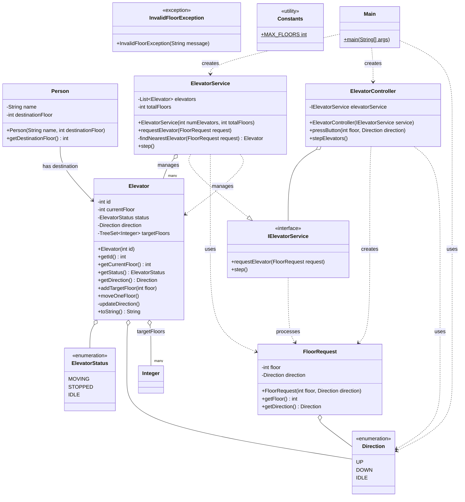

# Elevator System - Low Level Design

A comprehensive object-oriented elevator system implementation in Java demonstrating clean architecture, design patterns, and efficient elevator scheduling algorithms.

## 🏗️ System Architecture

This elevator system follows a layered architecture with clear separation of concerns:

- **Model Layer**: Core domain entities and enums
- **Service Layer**: Business logic and elevator scheduling
- **Controller Layer**: Request handling and coordination
- **Exception Layer**: Custom error handling
- **Utility Layer**: System constants and configurations


## 📁 Project Structure

```
elevator-system/
├── model/
│   ├── Elevator.java          # Core elevator entity
│   ├── ElevatorStatus.java    # Status enumeration
│   ├── Direction.java         # Movement direction enum
│   ├── FloorRequest.java      # Floor request model
│   └── Person.java            # Person entity
├── service/
│   ├── IElevatorService.java  # Service interface
│   └── ElevatorService.java   # Core business logic
├── controller/
│   └── ElevatorController.java # Request controller
├── exception/
│   └── InvalidFloorException.java # Custom exceptions
├── util/
│   └── Constants.java         # System constants
└── Main.java                  # Application entry point
```

## UML Diagram



## 🚀 Key Features

### Core Functionality

- **Multi-elevator Management**: Supports multiple elevators with independent scheduling
- **Smart Assignment**: Nearest-elevator algorithm for optimal request distribution
- **Efficient Movement**: TreeSet-based floor targeting for sorted movement patterns
- **Real-time Status**: Live tracking of elevator position, direction, and status


### Design Patterns

- **Strategy Pattern**: Extensible elevator assignment algorithms
- **Interface Segregation**: Clean service abstractions
- **Single Responsibility**: Each class handles one specific concern


## 🔧 How to Run

```bash
# Compile the project
javac -d bin src/**/*.java

# Run the application
java -cp bin Main
```


## 💡 Usage Example

```java
// Initialize system with 3 elevators and 10 floors
ElevatorService service = new ElevatorService(3, 10);
ElevatorController controller = new ElevatorController(service);

// Request elevators
controller.pressButton(3, Direction.UP);
controller.pressButton(7, Direction.DOWN);
controller.pressButton(2, Direction.UP);

// Simulate system steps
for (int i = 0; i < 10; i++) {
    controller.stepElevators();
}
```


## 🎯 System Components

### Elevator Model

- Tracks current floor, status, and direction
- Maintains sorted target floors using TreeSet
- Implements efficient one-step movement logic


### Service Layer

- **IElevatorService**: Defines core operations
- **ElevatorService**: Implements elevator assignment and coordination
- Uses nearest-elevator algorithm for request distribution


### Controller Layer

- **ElevatorController**: Handles user interactions
- Provides simple API for button presses and system stepping


## 📊 Algorithm Details

### Elevator Assignment

Currently implements a **nearest-elevator** algorithm that assigns requests to the closest available elevator based on floor distance.

### Movement Logic

- Uses TreeSet for O(log n) floor insertion and retrieval
- Elevators move one floor per step toward their next target
- Automatic direction and status updates based on remaining targets


## 🔮 Future Enhancements

### Advanced Features

- **Person Queue Management**: Track passengers inside elevators
- **Load Balancing**: Distribute requests based on elevator capacity
- **Priority Requests**: Emergency or VIP request handling
- **Maintenance Mode**: Handle elevator outages and repairs


### Algorithm Improvements

- **SCAN Algorithm**: Elevator continues in current direction until no more requests
- **LOOK Algorithm**: Reverses direction when reaching the last request in current direction
- **Shortest Seek Time First**: Prioritize closest requests regardless of direction


### System Monitoring

- Real-time dashboard for elevator status
- Performance metrics and analytics
- Request queue visualization
- Historical data tracking


## 🏛️ Design Principles

- **SOLID Principles**: Clean, maintainable, and extensible code
- **Separation of Concerns**: Clear layer boundaries
- **Open/Closed Principle**: Easy to extend without modifying existing code
- **Dependency Injection**: Loose coupling through interfaces


## 📈 Scalability Considerations

- **Horizontal Scaling**: Easy to add more elevators
- **Configuration Management**: Centralized constants and settings
- **Performance Optimization**: Efficient data structures and algorithms
- **Memory Management**: Minimal object creation in movement loops

This elevator system provides a solid foundation for understanding low-level design principles while remaining extensible for production-level enhancements.

