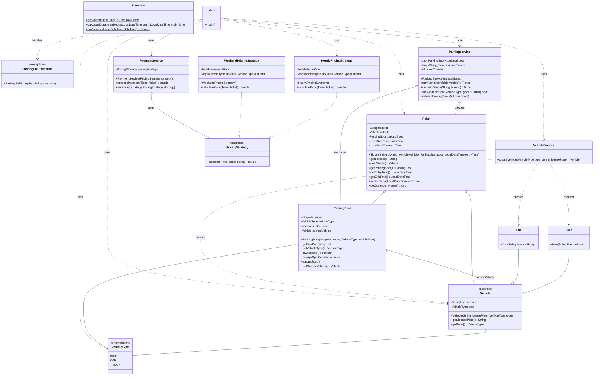

# Parking Lot Management System - Low Level Design

## Overview
This project implements a comprehensive parking lot management system using object-oriented design principles. The system handles vehicle parking, payment processing, and various pricing strategies for different vehicle types.

## System Architecture

### Core Components

#### 1. Models (`src/model/`)
- **Vehicle.java** - Abstract base class for all vehicle types
- **Car.java** - Concrete implementation for car vehicles
- **Bike.java** - Concrete implementation for bike/motorcycle vehicles
- **VehicleType.java** - Enum defining supported vehicle types
- **ParkingSpot.java** - Represents individual parking spaces
- **Ticket.java** - Manages parking tickets and duration tracking

#### 2. Factory Pattern (`src/factory/`)
- **VehicleFactory.java** - Creates vehicle instances based on type using Factory pattern

#### 3. Services (`src/service/`)
- **ParkingService.java** - Core parking operations (park, unpark, find spots)
- **PaymentService.java** - Handles payment processing and fee calculations

#### 4. Strategy Pattern (`src/strategy/`)
- **PricingStrategy.java** - Interface for different pricing algorithms
- **HourlyPricingStrategy.java** - Standard hourly rate pricing
- **WeekendPricingStrategy.java** - Special weekend pricing rates

#### 5. Exception Handling (`src/exception/`)
- **ParkingFullException.java** - Thrown when parking lot reaches capacity

#### 6. Utilities (`src/utils/`)
- **DateUtils.java** - Helper methods for date/time operations

## Key Features

### 🚗 Multi-Vehicle Support
- Cars
- Bikes/Motorcycles
- Extensible design for additional vehicle types

### 🅿️ Smart Parking Management
- Automatic spot allocation
- Vehicle type-specific parking areas
- Real-time availability tracking

### 💰 Flexible Pricing System
- Hourly pricing strategy
- Weekend premium rates
- Strategy pattern allows easy addition of new pricing models

### 🎫 Ticket Management
- Automated ticket generation
- Duration tracking
- Fee calculation integration

## Design Patterns Used

### 1. Factory Pattern
```java
// VehicleFactory creates vehicles based on type
Vehicle vehicle = VehicleFactory.createVehicle(VehicleType.CAR, "ABC123");
```

### 2. Strategy Pattern
```java
// Different pricing strategies can be applied
PricingStrategy strategy = new HourlyPricingStrategy();
double fee = strategy.calculateFee(duration, vehicleType);
```

### 3. Exception Handling
```java
// Custom exceptions for business logic
throw new ParkingFullException("No available spots for " + vehicleType);
```

## Project Structure
```
LowLevelDesign-Prep/
├── src/
│   ├── parkinglot/
│   │   ├── exception/
│   │   │   └── ParkingFullException.java
│   │   ├── factory/
│   │   │   └── VehicleFactory.java
│   │   ├── model/
│   │   │   ├── Bike.java
│   │   │   ├── Car.java
│   │   │   ├── ParkingSpot.java
│   │   │   ├── Ticket.java
│   │   │   ├── Vehicle.java
│   │   │   └── VehicleType.java
│   │   ├── service/
│   │   │   ├── ParkingService.java
│   │   │   └── PaymentService.java
│   │   ├── strategy/
│   │   │   ├── HourlyPricingStrategy.java
│   │   │   ├── PricingStrategy.java
│   │   │   └── WeekendPricingStrategy.java
│   │   └── utils/
│   │       └── DateUtils.java
│   └── Main.java
└── README.md
```

## UML Diagram



## Getting Started

### Prerequisites
- Java 8 or higher
- IDE (IntelliJ IDEA, Eclipse, or VS Code)

### Running the Application
1. Clone the repository
2. Open the project in your IDE
3. Run `Main.java` to start the parking lot system

### Example Usage
```java
// Initialize parking lot
ParkingService parkingService = new ParkingService();

// Park a car
Vehicle car = VehicleFactory.createVehicle(VehicleType.CAR, "ABC123");
Ticket ticket = parkingService.parkVehicle(car);

// Unpark and calculate fee
PaymentService paymentService = new PaymentService();
double fee = paymentService.calculateFee(ticket);
parkingService.unparkVehicle(ticket);
```

## Core Functionality

### Parking Operations
- **Park Vehicle**: Allocates appropriate parking spot based on vehicle type
- **Unpark Vehicle**: Releases parking spot and calculates fees
- **Find Available Spots**: Returns list of available spots for specific vehicle type

### Payment Processing
- **Fee Calculation**: Uses strategy pattern for flexible pricing
- **Multiple Pricing Models**: Hourly, weekend, and extensible for more strategies
- **Duration Tracking**: Automatic calculation of parking duration

### Exception Handling
- **Parking Full**: Graceful handling when no spots available
- **Invalid Vehicle**: Validation for vehicle registration and type
- **Payment Errors**: Robust error handling for payment processing

## Design Principles

### SOLID Principles
- **Single Responsibility**: Each class has a single, well-defined purpose
- **Open/Closed**: System is open for extension (new vehicle types, pricing strategies)
- **Liskov Substitution**: Vehicle subtypes can be used interchangeably
- **Interface Segregation**: Focused interfaces for specific functionality
- **Dependency Inversion**: High-level modules don't depend on low-level modules

### Design Patterns Benefits
- **Maintainability**: Easy to modify and extend
- **Scalability**: Can handle growing requirements
- **Testability**: Modular design enables comprehensive testing
- **Flexibility**: Strategy pattern allows runtime behavior changes

## Future Enhancements

### Planned Features
- **Reservation System**: Pre-booking of parking spots
- **Multi-Level Support**: Support for multiple parking floors
- **Mobile Integration**: API endpoints for mobile applications
- **Real-time Monitoring**: Dashboard for parking lot status
- **Dynamic Pricing**: AI-based pricing adjustments

### Extensibility Points
- **New Vehicle Types**: Electric vehicles, trucks, buses
- **Additional Pricing Strategies**: Peak hour pricing, loyalty discounts
- **Payment Methods**: Credit cards, digital wallets, subscription plans
- **Reporting System**: Analytics and usage reports

## Contributing
1. Fork the repository
2. Create a feature branch
3. Implement your changes following the existing design patterns
4. Add appropriate tests
5. Submit a pull request

## License
This project is created for educational purposes as part of Low Level Design practice.

## Contact
For questions or suggestions regarding this parking lot system implementation, please open an issue in the repository.
