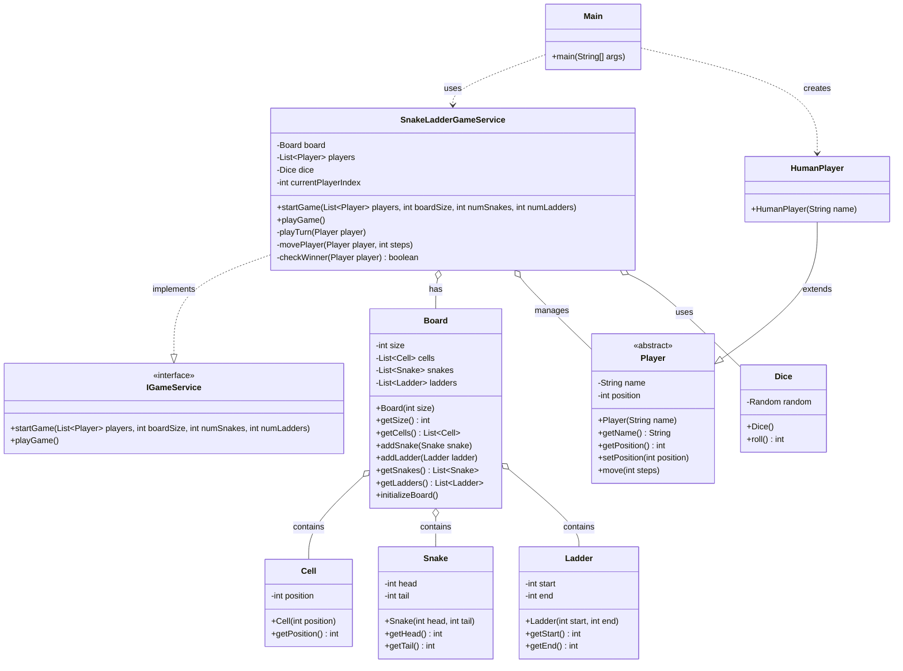

# Snake and Ladder Game -  Low Level Design (LLD)

A Java implementation of the classic Snake and Ladder board game following object-oriented design principles and low-level design (LLD) best practices.

## Project Structure

```
snakeandladder/
├── app/
│   └── Main.java                    # Entry point of the application
├── model/
│   ├── player/
│   │   ├── Player.java              # Abstract player class
│   │   └── HumanPlayer.java         # Human player implementation
│   ├── Board.java                   # Game board representation
│   ├── Cell.java                    # Individual cell on the board
│   ├── Ladder.java                  # Ladder entity with start and end positions
│   └── Snake.java                   # Snake entity with head and tail positions
├── service/
│   └── impl/
│       ├── SnakeLadderGameService.java  # Game service implementation
│       └── IGameService.java            # Game service interface
└── util/
    └── Dice.java                    # Dice utility for generating random rolls
```

## Design Overview

### Core Components

#### 1. **Model Layer**
- **Player**: Abstract base class for different player types
    - **HumanPlayer**: Concrete implementation for human players
- **Board**: Manages the game board, snakes, and ladders
- **Cell**: Represents individual cells on the board
- **Snake**: Contains head (start) and tail (end) positions
- **Ladder**: Contains start and end positions

#### 2. **Service Layer**
- **IGameService**: Interface defining game operations
- **SnakeLadderGameService**: Core game logic implementation
    - Manages player turns
    - Handles dice rolls
    - Processes snake and ladder encounters
    - Determines win conditions

#### 3. **Utility Layer**
- **Dice**: Generates random dice rolls (1-6)

## Key Features

- **Multiple Players**: Support for multiple human players
- **Random Board Generation**: Snakes and ladders are placed randomly on the board
- **Turn-based Gameplay**: Players take turns rolling the dice
- **Automatic Snake/Ladder Detection**: Automatically moves players when landing on snakes or ladders
- **Win Condition**: First player to reach the final cell wins

## Design Principles Applied

### SOLID Principles
- **Single Responsibility**: Each class has a single, well-defined purpose
- **Open/Closed**: Player class is open for extension (HumanPlayer) but closed for modification
- **Interface Segregation**: IGameService provides a clean contract for game operations
- **Dependency Inversion**: Service layer depends on abstractions (interfaces) rather than concrete implementations

### Design Patterns
- **Strategy Pattern**: Player hierarchy allows different player implementations
- **Factory Pattern**: Can be extended to create different types of boards or players
- **Service Pattern**: Game logic is encapsulated in a service layer

## Game Rules

1. Players start at position 0
2. Players roll a dice (1-6) to move forward
3. Landing on a ladder moves the player up to the ladder's end position
4. Landing on a snake moves the player down to the snake's tail position
5. The first player to reach or exceed the final cell wins
6. Players must roll the exact number to reach the final cell (or can overshoot depending on implementation)

## UML Diagram



## How to Run

1. Compile all Java files:
   ```bash
   javac -d out snakeandladder/**/*.java
   ```

2. Run the main class:
   ```bash
   java -cp out snakeandladder.app.Main
   ```

## Example Usage

```java
// Create players
List<Player> players = Arrays.asList(
    new HumanPlayer("Alice"),
    new HumanPlayer("Bob")
);

// Initialize game service
IGameService gameService = new SnakeLadderGameService();

// Start the game
gameService.startGame(players, boardSize, numSnakes, numLadders);
```

## Future Enhancements

- Add computer player AI
- Implement different board sizes
- Add special rules (e.g., exact number to win)
- Support for multiple dice
- Configurable snake and ladder positions
- Save and load game state

## Class Responsibilities

| Class | Responsibility |
|-------|----------------|
| Main | Application entry point, initializes and starts the game |
| Player | Abstract representation of a player |
| HumanPlayer | Concrete player controlled by human input |
| Board | Manages board state, snakes, and ladders |
| Cell | Represents a single position on the board |
| Snake | Defines snake position (head to tail) |
| Ladder | Defines ladder position (start to end) |
| SnakeLadderGameService | Implements core game logic and rules |
| IGameService | Defines game service contract |
| Dice | Generates random dice rolls |

## Contributing

Feel free to fork this project and submit pull requests for any enhancements or bug fixes.

## License

This project is open source and available for educational purposes.